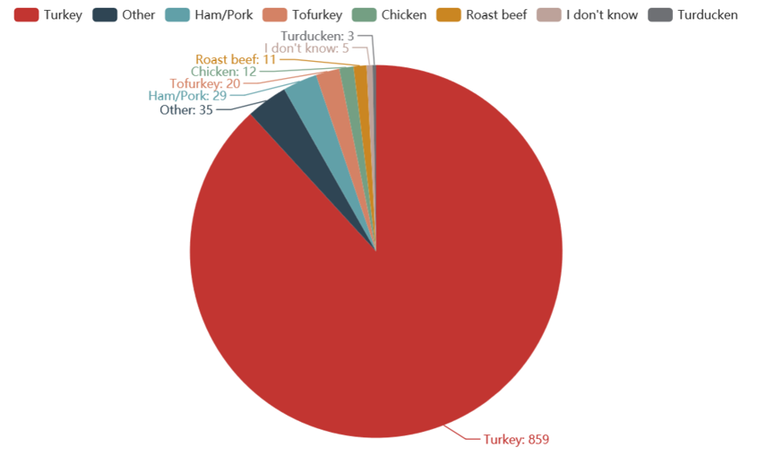
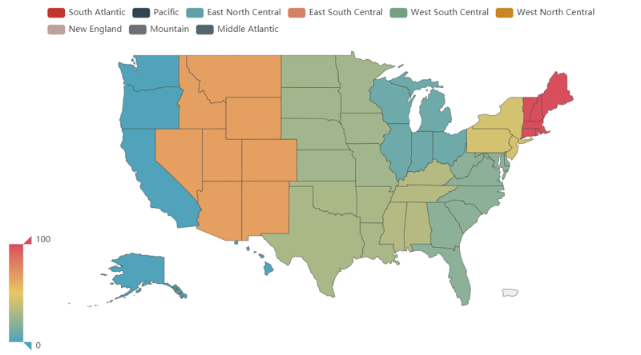
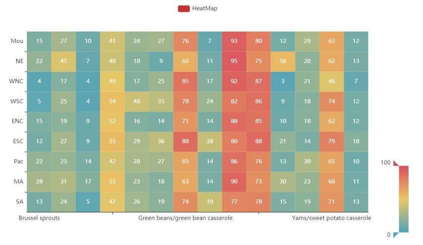

# Thankgiving-dataVisualization
A Thanksgiving data visualization program 

## Data source information 

The dataset used in the homework is a survey about thanksgiving holiday in 2015. The researchers asked approximately 1000 respondents on Nov. 17, 2015 questions about their Thanksgiving in aspects of eating and traveling etc. In this visualization work, I used several variables including the type of the main dish; types of side dishes typically served at Thanksgiving dinner; how far people travel for Thanksgiving and their US region. 
 
<b>Original data link</b>: https://github.com/fivethirtyeight/data/blob/master/thanksgiving2015/thanksgiving-2015-poll-data.csv 
 
This directory contains the data behind the story [Here’s What Your Part of America Eats On Thanksgiving](http://fivethirtyeight.com/features/heres-what-your-part-ofamerica-eats-on-thanksgiving). 
 
## Visualization result 
 
 The visualization tool is python3, API: pyecharts(https://pyecharts.org/#/). Pie, Map and Heatmap are 3 types of graphs provided to show the data. These 3 graphs are saved as html format.<b> All of them is interactive</b>. Legends bottom and visual map module can be clicked and slide respectively to show the related data or not.  

The screen shoot of 3 data visualization results are as follow:
 

<b>Pie</b>: In this graph, the variables “main dish” is used. The numbers behind each dishes are the amount of each type main dishes respondents choose.

<b>Map</b>: In this graph, I put 4 types of answer into 4 different scores. The table below shows the switch:

| ANSWERS                  | SCORES |
| ----------------------- |:----------------:|
| hanksgiving is happening at my home--I won't travel at all        | 0            |
| Thanksgiving is local--it will take place in the town I live in    | 25           |
| Thanksgiving is out of town but not too far--it's a drive of a few hours or less       | 75            |
| Thanksgiving is out of town and far away--I have to drive several hours or fly | 100           |

Then I counted the responses from different regions and calculated the average score. Finally, I normalized the scores and colored this map according to the size of the scores.

<b>HeatMap</b>: In this graph, I evaluate people's choices of 14 side dishes in 9 regions of the United States. The numbers shown in the figure are amount of chosen side dishes per 100 people. Due to the restriction of API version, names of side dishes on X axis are not completely shown. But these names can be seen when clicking the data bar.
